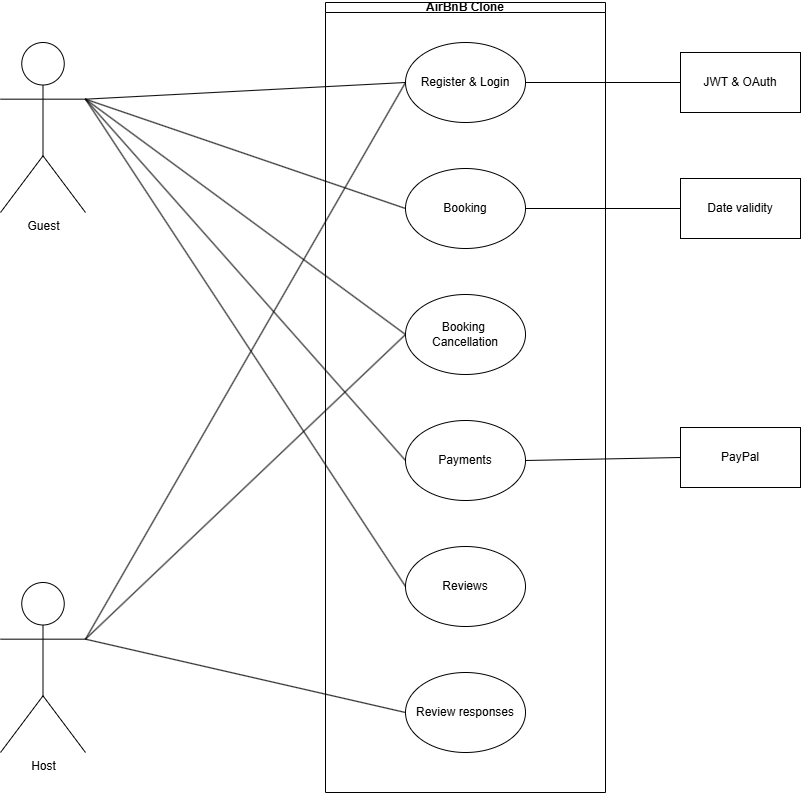

# Use Case Diagram for ALX Airbnb Project

## Overview

The use case diagram for the ALX Airbnb project outlines the interactions between users and the system. It helps to visualize the functional requirements of the project.

## Actors

- **Guest**: A user who searches for and books accommodations.
- **Host**: A user who lists their property for rent.
- **Admin**: A user who manages the platform and handles user issues.

## Use Cases

### Guest

- **Search Listings**: Allows guests to search for available properties.
- **View Listing Details**: Allows guests to view detailed information about a property.
- **Book Property**: Allows guests to book a property.
- **Leave Review**: Allows guests to leave a review for a property they have stayed at.

### Host

- **List Property**: Allows hosts to list their property on the platform.
- **Manage Listings**: Allows hosts to update or remove their property listings.
- **View Bookings**: Allows hosts to view bookings made by guests.
- **Respond to Reviews**: Allows hosts to respond to reviews left by guests.

### Admin

- **Manage Users**: Allows admins to manage guest and host accounts.
- **Resolve Issues**: Allows admins to resolve issues reported by users.
- **Monitor Activity**: Allows admins to monitor platform activity for any irregularities.

## Diagram

## Summary

This use case diagram provides a high-level overview of the interactions between different users and the ALX Airbnb system. It helps in understanding the functional requirements and designing the system accordingly.
